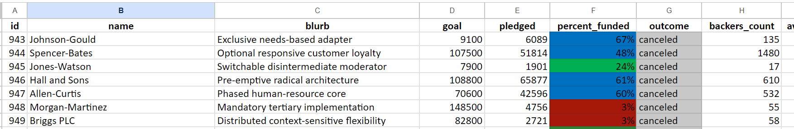
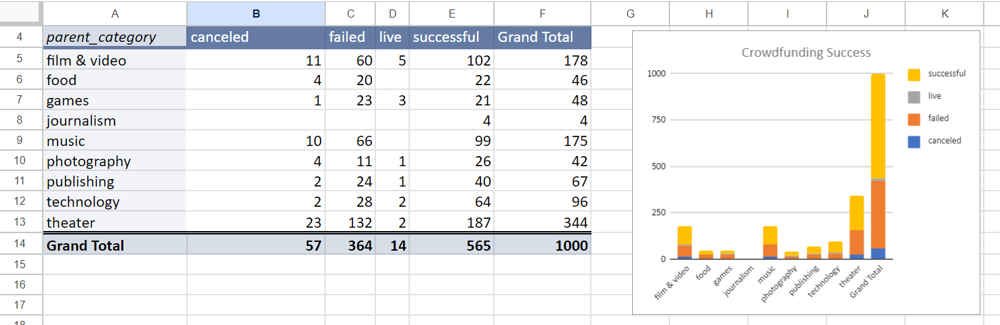
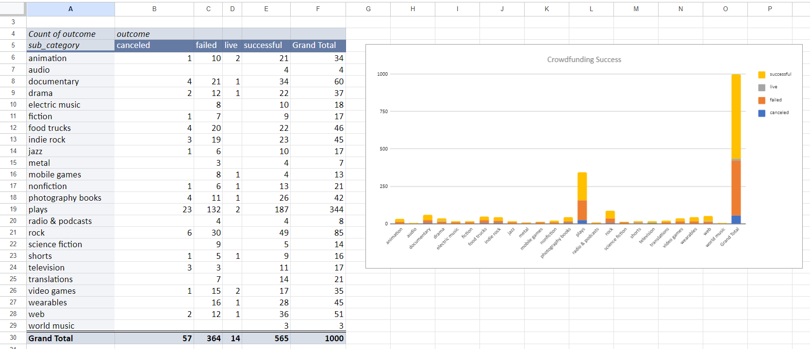
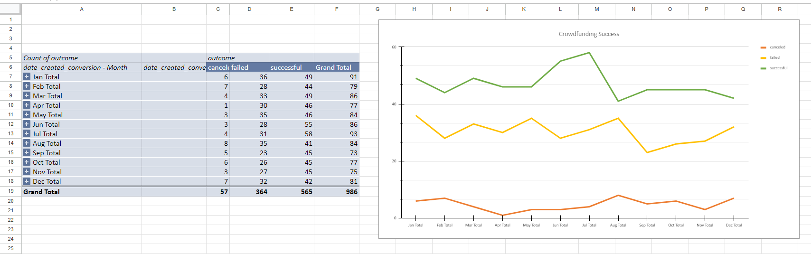
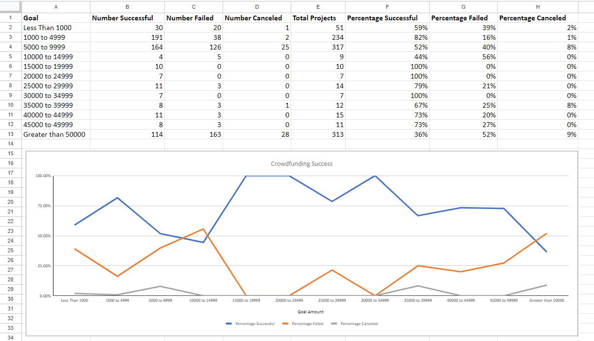
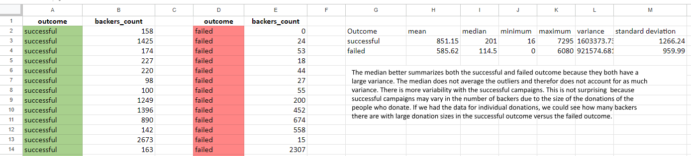

# excel-challenge
## Introduction
For this project, I was tasked with analyzing crowdfunding campaigns from an Excel dataset provided by edX Boot Camps LLC. Crowdfunding is when users utilize social media platforms to raise money for a cause. 

For the "Crowdfunding" worksheet (Figure 1), I utilized formulas and formatting to create a percent funded column with cells filled with different colors based on conditions. I also created an average donation column and split the "Category and Sub-Catergory" column into two separate columns. 

Next, I created a "Success by Category" sheet (Figure 2) with a pivot table analyzing the number of successful, live, failed and canceled campaigns by category and a pivot chart visualization. 

The "Success by Subcategory" sheet (Figure 3) is a stacked-column pivot chart analyzing campaigns by subcategory. 

In order to create the "Success by Date" sheet (Figure 4), I first had to add a column to worksheet 1 coverting the "launched_at" column  to a new column "date_created_conversion" using a formula to convert the timestamp to a normal date. I did the same to convert the "deadline" timestamp to a new column "date_ended_conversion." Next, I was able to utilize the converted columns into a pivot table that has a column of "outcome", row of "Date Created Conversion," values based on the count of "outcome," and filters based on "parent category" and "Years." Last, I created a pivot table line chart to visualize this data.

For the "Goal Analysis" sheet (Figure 5), I created a new column called "Goal" where I utilized the COUNTIFS() formula to count how many successful, failed, and canceled projects were created with goals of differing ranges. 

Lastly, the "Statistical Analysis" sheet (Figure 6) was created in order to gain a better understanding of campaign backers. I first created four columns; successful outcomes, number of backers, unsuccessful outcomes, number of backers. I then utilized formulas to find the mean backers, median backers, minumum backers, maximum backers, variance of the number of backers, and the standard deviation of backers for both successful and unsuccessful campaigns. 

Figure 1: 

Figure 2: 

Figure 3: 

Figure 4: 

Figure 5: 

Figure 6: 

# Analysis

## Given the provided data, what conclusions we can draw about crowdfunding campaigns?
June and July have the most successful crowdfunding success. August was the least successful month with the lowest amount of successful crowdfunding campaigns and one of the highest number of failed campaigns.

The category of theater and subcategory of plays have the most crowdfunding campaigns.

The $15,000 to & $19,999 goal as well as the $30,000 to $34,999 goal amounts had 100% success however they only had 10 and 7 campaigns respectively. Out of the 3 highest total crowdfunding campaign goal ranges, the $1,000 to $4,999 had the highest success at 82% followed by $5,000 to $9,999 at 52% success. The greater than $50,000 only had 36% success.

## What are some limitations of this dataset?

Some limitations of this dataset are that we don't know much about the creators of the campaign and if we had more information, we could have a better definition of success as well as see if there are few donors with large donation sizes and compare these with success and failures. 

If we knew more about the creators of the campaign, we could see if we could collect data on how renowned they are (example how many followers on social media) and what efforts have they done outside of the crowdfunding source to create buzz.

Also, if we had access to each of the donations within each crowdfunding campaign, we could search to see if there are single donors who made large donations. The number of backers was higher in the successful campaigns versus the failed campaigns, however the variance was higher in the successful campaigns. It would be interesting to see if this was because certain campaigns had single large contributions from single donors in the successful campaigns and not so much in the unsuccessful campaigns. There may be other trends that could emerge from analysis of this data as well.

The definition of success in this project was whether the creator reached their goal or the number of backers for the campaign . However, success could also be measured by whether the money raised fulfilled its intended purpose. Some of the people who raised money but didn’t reach “success” as defined could have still fulfilled their project goal (with less money). The opposite could be true as well; someone who reached “success” as we defined it could have not fulfilled its intended purpose. However, success defined this way would be harder to efficiently measure. 

## What are some other possible tables and/or graphs that we could create, and what additional value would they provide?

We could create a pivot table with the average goal for success vs. failed and compare it to the average donation of success vs. failed. It would be interesting to see if there is a correlation with goal size or donation size and success/failure. This information could help future crowd sourcers develop a realistic goal for success.

We could also add an additional pivot graph on the category and subcategory tabs to see the percentage of successful/failed campaigns within each category or subcategory. The current graph shows us which campaigns are more popular but it is harder to read the percentage comparison of successful/failed because there is a larger number of theater/play campaigns and the other categories show a smaller display.

Additionally we could dig deeper into the greater than $50,000 goal “failed” campaigns to see what the percentage of pledged/goal divided into ranges (ex. 0-25%, 26-50%, 51-75%, 76-99%) that way we could determine what percentage of the goal was met. A lot of the goals were significantly lower and having a lofty goal of greater than $50,000 would have higher pledge amounts and it would be interesting to see what percentage of failed were within the 76-99% pledge/goal compared to the other ranges. It would be helpful to know whether crowdfunders receive more pledge amount by setting the goal higher. We could create a pivot table and graph to display this information.

## Credits

I used the website ablebits.com for help with the COUNTIFS formula. I also utized help from the AskBCS Learning Assistants to add newly created columns to my pivot table by clicking "refresh" under "data."
